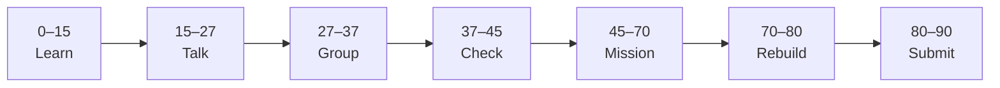

# Lesson 8: Docker, PostgreSQL & Fetching Data


| | |
|:---|:---|
| **Time** | 90 minutes |
| **Evidence** | `independent-rebuild/` + follow-along folder |
| **Independent rebuild** | `independent-rebuild/lesson-08/` · [rules](../INDEPENDENT_REBUILD.md) |

> [!TIP]
> Mission card → **45–70 Mission Task** → **70–80 Rebuild/Exit** → submit evidence.

**Your repo:** `[studentName]-Full-Stack-Web-and-AI-Application`

## Lesson Goal

By the end of this lesson, each student should be able to:

1. Complete Udemy **§3 Backend: Setting Up Docker, DB & Fetching Data** (7 lectures · ~51 min).
2. Run **PostgreSQL** (Docker or local) and connect the Kanban app with **Drizzle ORM**.
3. Fetch board data server-side and show **loading** while data loads.
4. Show a clear **error state** when DB is down (stop Docker to demo).
5. Relate fetch/loading/error patterns to **FastAPI fetch** from Phase 01 (`full-stack-practice/`).
6. **Independent rebuild:** hand-type fetch + loading + error in `vibe-coding/independent-rebuild/lesson-08/` — [INDEPENDENT_REBUILD.md](../INDEPENDENT_REBUILD.md).

---

## 90-Minute Class Flow



### 0–15 min: Individual Learning

> [!NOTE]
> **One required resource** for this block — see below. Do not browse extra playlists during class.

**Required resource — Udemy §3:**

[Complete Cursor AI — §3 Backend: Docker, DB & Fetching Data](https://www.udemy.com/course/cursorai-nextjs/)

Complete all **7 lectures** in this section.

**Bridge reading (5 min):** Re-read your Phase 01 CORS/fetch notes in `full-stack-practice/FIRST_SUCCESS.md`.

**Individual notes:**

```text
Docker in this course...
Drizzle ORM is...
Server-side fetch happens in...
Loading UI shows when...
Error UI shows when DB...
Same pattern as FastAPI fetch because...
One thing I still do not understand is...
```

---

### 15–27 min: Talk Robin / Group Discussion

**Share:** Loading vs error when Postgres stops; how this mirrors FastAPI backend down.

---

### 27–37 min: Group Answer

```text
Without loading users think...
Without error users think...
Capstone will use FastAPI instead of Server Actions for...
Our group still needs help with...
```

---

### 37–45 min: Entry Points Check

**Teacher checks:** Docker/Postgres running; §2 UI complete; `npm run dev` shows board.

---

### 45–70 min: Mission Task

1. Complete §3 with Cursor — database schema + fetch wired to UI.
2. Verify **loading** state during slow fetch (throttle or refresh).
3. Stop DB — capture **error** UI screenshot.
4. Add to `vibe-coding/README.md` section **Phase 01 vs Phase 02 backend**:

   ```text
   Phase 01: Next.js → FastAPI → response
   Phase 02: Next.js → PostgreSQL (course) → capstone: Next.js → FastAPI → RAG
   ```

5. Commit: `Connect Kanban DB fetch with loading and error states`.

---

### 70–80 min: Independent Rebuild / Exit Check

> [!IMPORTANT]
> Independent work: close course videos, notes, AI tools, and follow-along code before this block.

**Required — no materials:** [INDEPENDENT_REBUILD.md](../INDEPENDENT_REBUILD.md)

1. Close Udemy, Cursor, Docker notes, and `kanban-cursor/`.
2. In `vibe-coding/independent-rebuild/lesson-08/`, **hand-type**:
   - Page that `fetch`es data (real API, or `setTimeout` mock array from memory)
   - **`isLoading`** state + loading UI
   - **`error`** state + error UI (demo by wrong URL or stopped server)
3. Add `REBUILD.md`; commit: `Independent rebuild lesson-08 (no materials)`.

**Oral check:** Show loading → success → error without opening follow-along.

---

### 80–90 min: Submission of Evidence

---

## What You Must Submit

1. Screenshots: loading + error + success (follow-along)
2. `independent-rebuild/lesson-08/` + `REBUILD.md` + rebuild screenshots
3. `vibe-coding/README.md` backend comparison notes
4. Udemy §3 progress screenshot
5. Commit history

---

## Success Criteria

1. Data from DB renders on follow-along board.
2. Loading/error visible in follow-along.
3. Student compares to Phase 01 FastAPI fetch.
4. **Rebuild** fetch pattern hand-typed without materials.

---

## Common Problems

| Problem | Try first |
|---|---|
| Docker permission denied | School IT policy; use local Postgres or teacher shared DB. |
| Connection string wrong | Check `.env`; never commit secrets. |
| Empty board after fetch | Verify migrations/seed data per course. |

---

## Fast Track Option

Log one SQL query result in README to prove you understand what Drizzle fetched.

---

Educational materials in this folder are copyright © 2026 Wang Morgan. All Rights Reserved.
