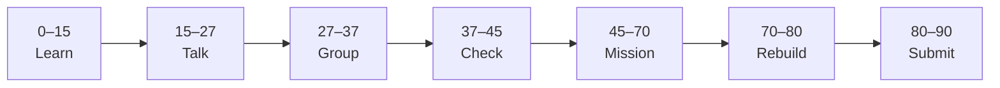

# Lesson 9: Server Actions, Notepads & Cursor Best Practices


| | |
|:---|:---|
| **Time** | 90 minutes |
| **Evidence** | `independent-rebuild/` + follow-along folder |
| **Independent rebuild** | `independent-rebuild/lesson-09/` · [rules](../INDEPENDENT_REBUILD.md) |

> [!TIP]
> Mission card → **45–70 Mission Task** → **70–80 Rebuild/Exit** → submit evidence.

**Your repo:** `[studentName]-Full-Stack-Web-and-AI-Application`

## Lesson Goal

By the end of this lesson, each student should be able to:

1. Complete Udemy **§4 Backend: Building Server Actions & Spoon-Feeding Cursor** (4 lectures · ~37 min).
2. Complete Udemy **§5 Reusable Cursor Instructions: Notepads** (7 lectures · ~1 hr).
3. Implement **server-side mutations** (move/create card per course) using Cursor with **spoon-fed** context.
4. Create at least **one Notepad** (reusable Cursor instruction) for this project.
5. Complete [cursor-reflection-template](../../../../03_Templates/cursor-reflection-template.md) in `vibe-coding/cursor-reflection.md` and follow [AI Usage Policy](../../../../04_Assessment/AI_Usage_Policy.md).
6. **Independent rebuild:** hand-type one mutation (Server Action or `fetch` POST) in `vibe-coding/independent-rebuild/lesson-09/` — **no Cursor, no materials** — [INDEPENDENT_REBUILD.md](../INDEPENDENT_REBUILD.md).

---

## 90-Minute Class Flow



### 0–15 min: Individual Learning

> [!NOTE]
> **One required resource** for this block — see below. Do not browse extra playlists during class.

**Required resource — Udemy §4 + §5:**

[Complete Cursor AI — §4 Server Actions](https://www.udemy.com/course/cursorai-nextjs/) → then **§5 Notepads**

**Watch minimum in class:** first lecture of §4 + **Generating Cursor Rules** / Notepad intro from §5.

**Homework:** finish remaining §4–§5 lectures before Lesson 10.

**Individual notes:**

```text
Server Actions mutate data by...
Spoon-feeding Cursor means...
My Notepad instruction says...
AI must not replace my verification because...
One thing I still do not understand is...
```

---

### 15–27 min: Talk Robin / Group Discussion

**Share:** Your Notepad text; one mutation you tested manually after AI generated it.

---

### 27–37 min: Group Answer

```text
After AI generates mutations we always...
Notepads help because...
Capstone POST /ask will use FastAPI not Server Actions because...
Our group still needs help with...
```

---

### 37–45 min: Entry Points Check

**Teacher checks:** §3 data fetch works; plan written before any Agent prompt today.

---

### 45–70 min: Mission Task

**Workflow:**

```text
plan → Notepad/rules → prompt → read diff → run app → test mutation → commit → reflection
```

1. Save plan in `vibe-coding/plan-lesson-09.md` (bullets before Cursor).
2. Complete §4 — card create/move/delete via Server Actions (course steps).
3. Create **one Notepad** (e.g. “Kanban mutation checklist” or “Drizzle change workflow”).
4. Add `.cursor/rules` entry: **“Capstone backend is FastAPI on port 8000 — this project uses Postgres for learning only.”**
5. Complete `vibe-coding/cursor-reflection.md` — document one AI mistake you caught.
6. Commit: `Add Server Actions and Cursor Notepad — Lesson 9`.

---

### 70–80 min: Independent Rebuild / Exit Check

> [!IMPORTANT]
> Independent work: close course videos, notes, AI tools, and follow-along code before this block.

**Required — no materials:** [INDEPENDENT_REBUILD.md](../INDEPENDENT_REBUILD.md)

1. Close Udemy, Cursor, Notepads, and `kanban-cursor/`.
2. In `vibe-coding/independent-rebuild/lesson-09/`, **hand-type** one of:
   - **Server Action** that adds/updates one card in memory, **or**
   - **`fetch` POST** to a minimal route you also hand-typed
3. Demo mutation works; add `REBUILD.md` (include Notepad text you **remember**, not copy).
4. Commit: `Independent rebuild lesson-09 (no materials)`.

**Oral check:** Explain mutation flow without Cursor and without follow-along open.

---

### 80–90 min: Submission of Evidence

---

## What You Must Submit

1. `plan-lesson-09.md` + `cursor-reflection.md` (follow-along Cursor work)
2. `independent-rebuild/lesson-09/` + `REBUILD.md` + mutation demo screenshot
3. Notepad content from follow-along (screenshot OK)
4. Udemy §4–§5 progress screenshot
5. Commit history

---

## Success Criteria

1. Plan existed **before** Cursor Agent work (follow-along).
2. Server Action or POST mutation works in follow-along.
3. Notepad created in follow-along.
4. **Rebuild** mutation hand-typed without Cursor/materials.
5. Reflection documents verification or AI error.
6. No secrets in prompts.

---

## Common Problems

| Problem | Try first |
|---|---|
| Server Action silent fail | Check network tab; read server logs; validate Zod/schema. |
| AI changed too many files | Notepad: “only edit files I list”; use Ask mode first. |
| Confused vs FastAPI POST | Note in README — capstone uses Pydantic on FastAPI. |

---

## Fast Track Option

Second Notepad for “UI-only changes” vs “DB mutation changes” — enforce scope.

---

Educational materials in this folder are copyright © 2026 Wang Morgan. All Rights Reserved.
