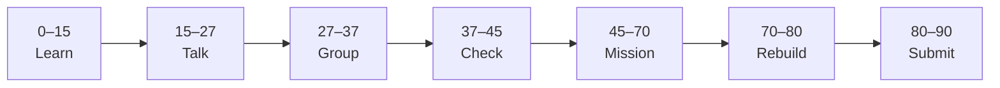

# Lesson 10: Rapid Features, Summary & Capstone Bridge


| | |
|:---|:---|
| **Time** | 90 minutes |
| **Evidence** | `independent-rebuild/` + follow-along folder |
| **Independent rebuild** | `independent-rebuild/lesson-10/` · [rules](../INDEPENDENT_REBUILD.md) |

> [!TIP]
> Mission card → **45–70 Mission Task** → **70–80 Rebuild/Exit** → submit evidence.

**Your repo:** `[studentName]-Full-Stack-Web-and-AI-Application`

## Lesson Goal

By the end of this lesson, each student should be able to:

1. Complete Udemy **§6 Building Features**, **§7 Building Things Really Quickly**, and **§8 Summary and What's Next?**
2. Ship at least **one extra Kanban feature** using Cursor rapid-build techniques from the course.
3. Write `vibe-coding/CAPSTONE_BRIDGE.md` — map Kanban + Cursor skills → **AI School Assistant**.
4. Complete **05 Vibe Coding** checklist and pass oral exam.
5. **Independent rebuild:** hand-type one capstone-style feature in `vibe-coding/independent-rebuild/lesson-10/` — [INDEPENDENT_REBUILD.md](../INDEPENDENT_REBUILD.md).

---

## 90-Minute Class Flow



### 0–15 min: Individual Learning

> [!NOTE]
> **One required resource** for this block — see below. Do not browse extra playlists during class.

**Required resource — Udemy §6–§8:**

[Complete Cursor AI — §6 Building Features](https://www.udemy.com/course/cursorai-nextjs/) → **§7 Building Things Really Quickly** → **§8 Summary**

Re-read `full-stack-practice/FIRST_SUCCESS.md` and `vibe-coding/cursor-reflection.md`.

**Individual notes:**

```text
From Kanban to capstone I reuse...
Cursor skills I keep: rules, notepads, verify...
Udemy stack vs capstack (FastAPI) differs in...
My vibe coding rule going forward is...
One thing I still do not understand is...
```

---

### 15–27 min: Talk Robin / Group Discussion

Each student: map one Figma screen → Kanban lesson learned → future `nextjs-frontend/` route → `fastapi-backend/` route.

---

### 27–37 min: Group Answer

```text
AI School Assistant stack is...
Integration checkpoint C7 needs...
Responsible vibe coding means...
Our group still needs help with...
```

---

### 37–45 min: Entry Points Check

**Teacher checks:** Lessons 6–9 evidence; Kanban runs with DB + at least one mutation.

---

### 45–70 min: Mission Task

1. Finish §6–§7 — add one course feature (filter, drag polish, quick win from §7).
2. Watch §8 Summary; note **3 takeaways** in `vibe-coding/README.md`.
3. Create `vibe-coding/CAPSTONE_BRIDGE.md`:

   ```markdown
   # Kanban Practice → AI School Assistant

   ## Reuse from Phase 01 (full-stack-practice)
   - CORS + fetch POST pattern
   - FIRST_SUCCESS story

   ## Reuse from Phase 02 (kanban-cursor)
   - Cursor Rules + Notepads workflow
   - Loading / error UI patterns
   - Plan → prompt → diff → test → commit

   ## Stack mapping (important)
   | Kanban course | Capstone |
   |---|---|
   | PostgreSQL + Drizzle | FastAPI + DB/RAG store |
   | Server Actions | FastAPI routes (e.g. POST /ask) |
   | Cursor Agent | Cursor on capstone repo only (Phase 10 policy) |

   ## Figma screens → routes
   - Ask page → ...
   - Result page → ...

   ## Next self-study (optional)
   - Finish Udemy Kanban if any lectures remain
   - Phase 01 Project 2 (FastAPI bridge course)
   ```

4. Update Notion; link GitHub folders.
5. Commit: `Complete 05 Vibe Coding — Kanban + capstone bridge`.

---

### 70–80 min: Independent Rebuild / Exit Check

> [!IMPORTANT]
> Independent work: close course videos, notes, AI tools, and follow-along code before this block.

**Required — no materials:** [INDEPENDENT_REBUILD.md](../INDEPENDENT_REBUILD.md)

1. Close Udemy, Cursor, and all follow-along folders.
2. In `vibe-coding/independent-rebuild/lesson-10/`, **hand-type** a **mini Kanban or ask-form** that combines:
   - UI from memory (column or form)
   - Data fetch or mutation from memory
   - Loading + error states
3. Map in `REBUILD.md` how this rebuild connects to **AI School Assistant** (FastAPI backend).
4. Commit: `Independent rebuild lesson-10 (no materials)`.

**Oral quiz (teacher picks 3):**

- Demo **rebuild** only (not follow-along)
- Explain Cursor Rule + Notepad from memory
- How capstone uses **FastAPI** instead of Server Actions

---

### 80–90 min: Submission of Evidence

**05 Vibe Coding checklist:**

<details>
<summary><strong>05 Vibe Coding checklist</strong></summary>

```text
[ ] Phase 01: FIRST_SUCCESS.md + working Project 1
[ ] Phase 01: independent-rebuild/lesson-01 … lesson-05 each with REBUILD.md
[ ] Phase 02: Kanban follow-along UI + DB + mutation
[ ] Phase 02: independent-rebuild/lesson-06 … lesson-10 each with REBUILD.md
[ ] vibe-coding/cursor-reflection.md (plan-first workflow)
[ ] CAPSTONE_BRIDGE.md
[ ] Udemy both courses progress (screenshots)
[ ] Notion updated
[ ] Oral exam passed on rebuild code
[ ] AI usage disclosed per policy
```

</details>

---

## What You Must Submit

1. GitHub links: follow-along + **`independent-rebuild/lesson-06` … `lesson-10`**
2. `CAPSTONE_BRIDGE.md`
3. Udemy progress screenshots
4. Kanban demo + **rebuild** demo screenshot
5. Notion portfolio URL

---

## Success Criteria

1. Kanban follow-along runs with UI + data + mutation.
2. **Ten** independent rebuild folders (Phase 01 + 02) with honest `REBUILD.md`.
3. Clear bridge to FastAPI capstone.
4. Phase 01 first success still reproducible from rebuild folders.

---

## Common Problems

| Problem | Try first |
|---|---|
| Behind on §6–§7 | Demo minimum feature; assign rest as homework. |
| Thinks capstone uses Postgres | Re-read CAPSTONE_BRIDGE stack table. |
| Skipped Phase 01 | Must show FastAPI fetch before sign-off. |

---

## After 05 Vibe Coding

**Formal course:** Phase 8 RAG · Phase 9 integration · Phase 10 Cursor capstone on **AI School Assistant**

**Optional homework:** Project 2 in [Learn Next.js and FastAPI](https://www.udemy.com/course/learn-nextjs-and-fastapi-by-building-2-full-stack-apps/)

---

Educational materials in this folder are copyright © 2026 Wang Morgan. All Rights Reserved.
