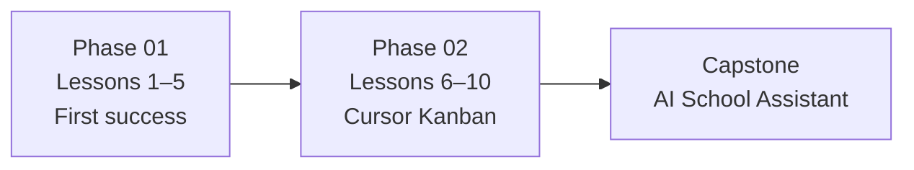

# 05 Vibe Coding — Class Missions

| | |
|:---|:---|
| **Classes** | 10 × 90 min |
| **Phase 01** | [Next.js + FastAPI](https://www.udemy.com/course/learn-nextjs-and-fastapi-by-building-2-full-stack-apps/) — first success |
| **Phase 02** | [Cursor AI Kanban](https://www.udemy.com/course/cursorai-nextjs/) — vibe workflow |
| **Evidence** | `full-stack-practice/` · `vibe-coding/` |

**Your repository:** `[studentName]-Full-Stack-Web-and-AI-Application`

> [!TIP]
> Display tips: [mission-display-guide.md](../shared/mission-display-guide.md) · Rebuild rules: [INDEPENDENT_REBUILD.md](INDEPENDENT_REBUILD.md)

**Prerequisite:** [Git](../01_Web_Tools/Phase_01_Git/) · [FastAPI](../03Back-end/Phase_01_FastAPI/) · [React/Next](../02Front-end/Phase_4_React_and_NextJS/) · [Figma](../01_Web_Tools/Phase_02_Figma/) recommended

> [!NOTE]
> Overlaps course **Phase 9–10**. Capstone backend stays **FastAPI** — Kanban uses Postgres/Server Actions for **Cursor practice** only.



---

## Phase Order

| Phase | Folder | Classes | Udemy course |
|---|---|---:|---|
| **01** | [Phase_01_First_Success/](Phase_01_First_Success/) | 1–5 | [Learn Next.js and FastAPI by Building 2 Full Stack Apps](https://www.udemy.com/course/learn-nextjs-and-fastapi-by-building-2-full-stack-apps/) |
| **02** | [Phase_02_NextJS_Deep_Dive/](Phase_02_NextJS_Deep_Dive/) | 6–10 | [Complete Cursor AI: Vibe Code a Full-Stack Next.js 15 App](https://www.udemy.com/course/cursorai-nextjs/) |

**Optional vibe warm-up (homework):** [Vibe Coding with Cursor AI — Coursera](https://www.coursera.org/learn/vibe-coding-with-cursor-ai) (~1h)

---

## Student Folders

```text
full-stack-practice/     ← Phase 01 Udemy projects (clone or follow-along)
├── README.md
├── backend/             ← FastAPI (or course layout)
└── frontend/            ← Next.js

vibe-coding/             ← Phase 02 reflections + Kanban Cursor project
├── README.md
├── kanban-cursor/       ← Udemy follow-along (materials OK)
├── independent-rebuild/ ← Memory-only code every lesson (see INDEPENDENT_REBUILD.md)
│   └── lesson-06/ … lesson-10/
├── cursor-reflection.md
└── FIRST_SUCCESS.md     ← Lesson 5 checkpoint story (Phase 01)

full-stack-practice/independent-rebuild/  ← Phase 01 memory-only (lesson-01 … lesson-05)
```

Capstone target (later formal phases): `nextjs-frontend/` + `fastapi-backend/` or `ai-school-assistant/`

---

## 90-Minute Flow (Every Class)

```text
0–15   Individual Learning (assigned Udemy sections)
15–27  Talk Robin / Group Discussion
27–37  Group Answer
37–45  Entry Points Check
45–70  Mission Task (run, connect, commit evidence)
70–80  Independent Rebuild / Exit Check
80–90  Submission of Evidence
```

Details: [classroom-flow.md](../shared/classroom-flow.md) · [ai-use-during-practice.md](../shared/ai-use-during-practice.md) · **[INDEPENDENT_REBUILD.md](INDEPENDENT_REBUILD.md)** (required every lesson)

---

## Independent Rebuild (Every Lesson)

Follow-along code and **memory-only rebuild** live in **separate folders**. Each class ends with a rebuild block: **close all materials**, hand-type code, commit to `independent-rebuild/lesson-XX/`.

```text
No Udemy · no course GitHub · no Cursor/AI · no copy-paste from follow-along · no open notes
```

Full rules and `REBUILD.md` template: [INDEPENDENT_REBUILD.md](INDEPENDENT_REBUILD.md)

---

## Vibe Coding Rule (This Track)

```text
Watch/build with Udemy first → understand the flow → then use Cursor for scoped follow-along tasks
Independent rebuild every lesson: close all materials → hand-type in independent-rebuild/lesson-XX/
You must: read diffs · run locally · fix errors · disclose AI help · explain rebuild orally
```

---

Educational materials in this folder are copyright © 2026 Wang Morgan. All Rights Reserved.
