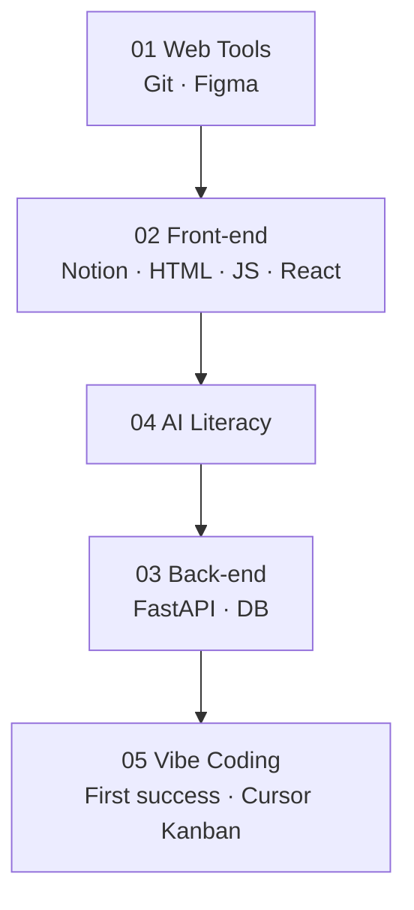

# Class Missions

**Open this folder during class.**

> [!TIP]
> **Easier reading:** use Markdown preview (`Ctrl+Shift+V` in Cursor) or view on GitHub. See [mission-display-guide.md](shared/mission-display-guide.md).

## Track map

| Track | Folder | Classes |
|---|---|---:|
| Web Tools | [01_Web_Tools/](01_Web_Tools/) | 11 (+1 opt) |
| Front-end | [02Front-end/](02Front-end/) | 20 |
| AI Literacy | [04AI_Literacy/](04AI_Literacy/) | 6 |
| Back-end | [03Back-end/](03Back-end/) or [Minimal_Back-end/](Minimal_Back-end/) | 10 |
| Vibe Coding | [05_Vibe_Coding/](05_Vibe_Coding/) | 10 |

---

## 01 Web Tools — Git & Figma

Start: [01_Web_Tools/README.md](01_Web_Tools/README.md)

### Phase 01 — Git & GitHub (6 classes)

[Phase_01_Git/README.md](01_Web_Tools/Phase_01_Git/README.md)

| Lesson | Class mission |
|---|---|
| 1 | [lesson-01-course-workflow-and-first-repo.md](01_Web_Tools/Phase_01_Git/lesson-01-course-workflow-and-first-repo.md) |
| 2 | [lesson-02-readme-and-commit-history.md](01_Web_Tools/Phase_01_Git/lesson-02-readme-and-commit-history.md) |
| 3 | [lesson-03-file-organization-and-learning-log.md](01_Web_Tools/Phase_01_Git/lesson-03-file-organization-and-learning-log.md) |
| 4 | [lesson-04-oh-my-git-commit-history.md](01_Web_Tools/Phase_01_Git/lesson-04-oh-my-git-commit-history.md) |
| 5 | [lesson-05-local-git-vscode-terminal.md](01_Web_Tools/Phase_01_Git/lesson-05-local-git-vscode-terminal.md) |
| 6 | [lesson-06-github-mastery-check.md](01_Web_Tools/Phase_01_Git/lesson-06-github-mastery-check.md) |
| 7 *(optional)* | [lesson-07-coursera-git-github-certification-sprint.md](01_Web_Tools/Phase_01_Git/lesson-07-coursera-git-github-certification-sprint.md) |

### Phase 02 — Figma (5 classes)

**After Phase 01 Git + Notion.** [Phase_02_Figma/README.md](01_Web_Tools/Phase_02_Figma/README.md)

| Lesson | Class mission |
|---|---|
| 1–5 | See [Phase_02_Figma/README.md](01_Web_Tools/Phase_02_Figma/README.md) |

Evidence: `figma-design/` · Course Phase 4

---

## 02 Front-end

Start: [02Front-end/README.md](02Front-end/README.md)

| Block | Lessons | README |
|---|---|---|
| Notion Portfolio | 2 | [Phase_1_Notion_Portfolio/](02Front-end/Phase_1_Notion_Portfolio/) |
| Web Basics | 2 | [Phase_2_Web_Basics/](02Front-end/Phase_2_Web_Basics/) |
| JavaScript | 3+ | [Phase_3_JavaScript/](02Front-end/Phase_3_JavaScript/) |
| React & Next.js | 10 | [Phase_4_React_and_NextJS/](02Front-end/Phase_4_React_and_NextJS/) |

---

## 04 AI Literacy (6 classes)

**After Git + Notion.** Start: [04AI_Literacy/README.md](04AI_Literacy/README.md)

| Lesson | Class mission |
|---|---|
| 1–6 | See [04AI_Literacy/README.md](04AI_Literacy/README.md) |

Resource: [AI for Everyone](https://www.deeplearning.ai/courses/ai-for-everyone) · Evidence: `ai-literacy/`

---

## 03 Back-end — FastAPI + Database (10 classes)

Start: [03Back-end/README.md](03Back-end/README.md) or [Minimal_Back-end/README.md](Minimal_Back-end/README.md)

| Phase | Lessons |
|---|---|
| FastAPI | 1–6 · [Phase_01_FastAPI/](03Back-end/Phase_01_FastAPI/) |
| Database | 7–10 · [Phase_02_Database/](03Back-end/Phase_02_Database/) |

---

## 05 Vibe Coding (10 classes)

**After** Git, FastAPI basics, React/Next. Start: [05_Vibe_Coding/README.md](05_Vibe_Coding/README.md)

| Phase | Classes | Udemy |
|---|---:|---|
| First Success | 1–5 | [Next.js + FastAPI](https://www.udemy.com/course/learn-nextjs-and-fastapi-by-building-2-full-stack-apps/) |
| Cursor Kanban | 6–10 | [Cursor AI Next.js 15](https://www.udemy.com/course/cursorai-nextjs/) |

Evidence: `full-stack-practice/` · `vibe-coding/` · [Independent rebuild rules](05_Vibe_Coding/INDEPENDENT_REBUILD.md)

---

## Shared Guides

- [classroom-flow.md](shared/classroom-flow.md) — 90-minute structure
- [mission-display-guide.md](shared/mission-display-guide.md) — **make missions look better**
- [mission-lesson-snippet.md](shared/mission-lesson-snippet.md) — copy-paste lesson header
- [mastery-levels.md](shared/mastery-levels.md)
- [talk-robin-rules.md](shared/talk-robin-rules.md)
- [exit-evidence-checklist.md](shared/exit-evidence-checklist.md)
- [ai-use-during-practice.md](shared/ai-use-during-practice.md)

---

Educational materials in this folder are copyright © 2026 Wang Morgan. All Rights Reserved.
