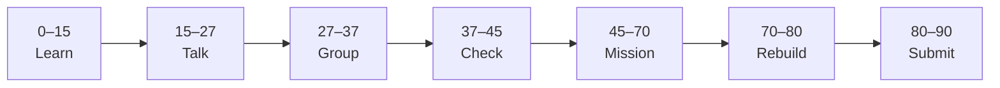
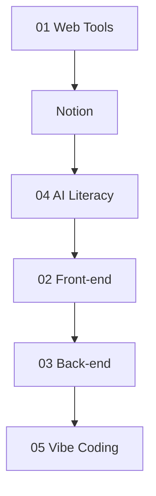

# Mission Display Guide — Make Class Missions Easier to Read

Use these patterns in **GitHub**, **Cursor preview**, and **VS Code Markdown preview**. They work without a separate website.

---

## 1. Mission card (top of every lesson)

Put a **quick-scan table** under the title so students see the essentials in 5 seconds:

```markdown
# Lesson 3: Example Title

| | |
|:---|:---|
| **Time** | 90 minutes |
| **Resource** | [Course name](https://…) — Module X |
| **Evidence** | `your-folder/` |
| **Independent rebuild** | `your-folder/independent-rebuild/lesson-03/` ([rules](../05_Vibe_Coding/INDEPENDENT_REBUILD.md) if applicable) |

> [!TIP]
> Skim the mission card → do **Mission Task** → finish **Independent rebuild** → submit evidence.
```

---

## 2. GitHub alerts (highlights)

GitHub renders these as colored callouts:

```markdown
> [!IMPORTANT]
> Close all materials before independent rebuild. Hand-type code only.

> [!NOTE]
> One required resource per class — do not browse extra playlists.

> [!WARNING]
> Do not paste AI-generated reflections without editing and understanding.
```

---

## 3. Mermaid — 90-minute flow

Replace long ASCII blocks with a diagram (GitHub + Cursor preview support Mermaid):

```markdown

```

Track overview (folder README):

```markdown

```

---

## 4. Collapsible sections (long checklists)

Keep the page short; expand when submitting:

```markdown
<details>
<summary><strong>Submission checklist</strong> (click to expand)</summary>

- [ ] README with links
- [ ] Screenshot on GitHub
- [ ] Oral check passed

</details>
```

---

## 5. Fix spacing in index READMEs

**Avoid** a blank line between **every** line of a table or list — GitHub shows double-height gaps and feels broken.

**Good:**

```markdown
| Lesson | File |
|---|---|
| 1 | [lesson-01.md](lesson-01.md) |
```

**Bad:** blank line after each table row.

---

## 6. Where students open missions

| Tool | How |
|---|---|
| **GitHub** | Browse repo → click lesson file (alerts + Mermaid render here) |
| **Cursor / VS Code** | Open `.md` → `Ctrl+Shift+V` (Preview) |
| **Phone** | GitHub mobile app or published site (see below) |

---

## 7. Optional: GitHub Pages (prettier site)

If you want a **book-style** site later:

1. Add `docs/` + MkDocs Material or `jekyll-theme-cayman`
2. Enable **Settings → Pages → Deploy from `docs/`**
3. Students get `https://<org>.github.io/<repo>/class-missions/`

Not required for class — Markdown + alerts is enough for most cohorts.

---

## 8. Snippet file

Copy the header block from [mission-lesson-snippet.md](mission-lesson-snippet.md) when authoring or refreshing a lesson.

---

## 9. Batch apply (canonical tracks)

Re-run after adding new lessons under `01_Web_Tools`, `02Front-end`, `03Back-end`, `04AI_Literacy`, or `05_Vibe_Coding`:

```bash
node 02_Class_Missions/scripts/apply-mission-markdown-style.mjs
```

Adds mission card, Mermaid flow, NOTE/IMPORTANT alerts, and collapsible checklists where applicable. Skips files already styled.

---

Educational materials in this folder are copyright © 2026 Wang Morgan. All Rights Reserved.
