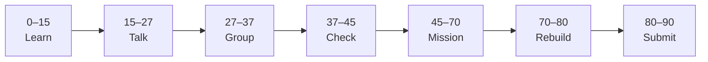

# Lesson X: [Title]

| | |
|:---|:---|
| **Time** | 90 minutes |
| **Resource** | [Name](https://…) — [section] |
| **Evidence** | `folder/` |
| **Independent rebuild** | `folder/independent-rebuild/lesson-0X/` · [INDEPENDENT_REBUILD.md](../05_Vibe_Coding/INDEPENDENT_REBUILD.md) *(if this track uses rebuild)* |

> [!TIP]
> Mission card → **45–70 Mission Task** → **70–80 Independent rebuild** → submit.

**Your repo:** `[studentName]-Full-Stack-Web-and-AI-Application`

---

## Lesson Goal

By the end of this lesson, each student should be able to:

1. …

---

## 90-Minute Class Flow



### 0–15 min: Individual Learning

> [!NOTE]
> **One required resource only** — see [classroom-flow.md](classroom-flow.md).

**Required resource:**

- …

### 45–70 min: Mission Task

1. …

### 70–80 min: Independent Rebuild / Exit Check

> [!IMPORTANT]
> Close Udemy, notes, Cursor/AI, and follow-along code. Hand-type in `independent-rebuild/lesson-0X/` only.

1. …
2. Add `REBUILD.md`; commit: `Independent rebuild lesson-0X (no materials)`.

---

## What You Must Submit

1. …

<details>
<summary><strong>Phase checklist</strong></summary>

```text
[ ] …
```

</details>

---

## Success Criteria

1. …

---

## Common Problems

| Problem | Try first |
|---|---|
| … | … |

---

Educational materials in this folder are copyright © 2026 Wang Morgan. All Rights Reserved.
