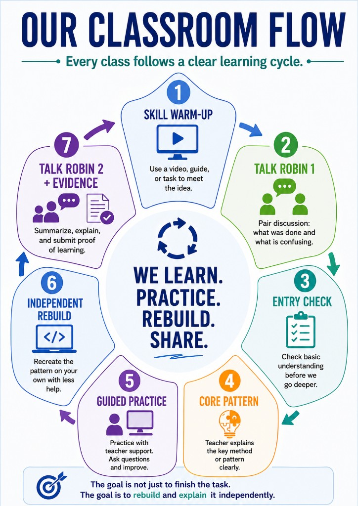
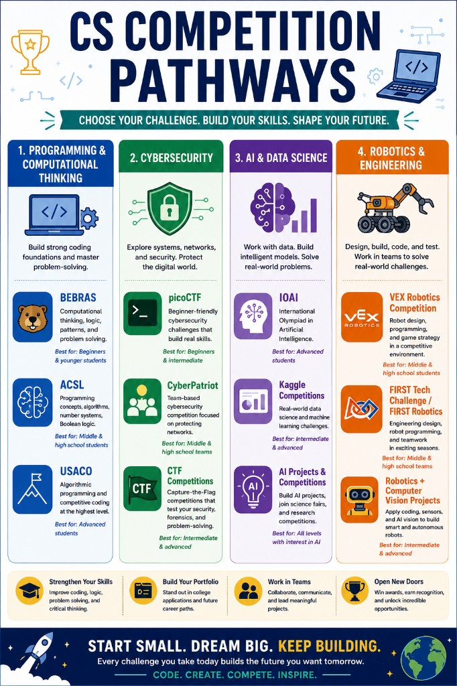
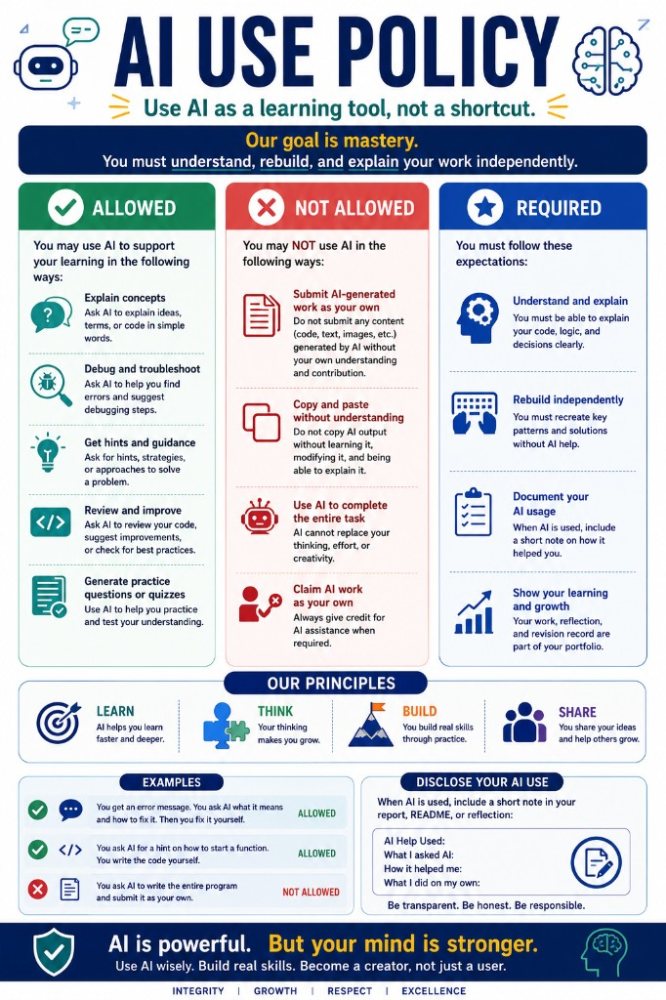

# Student Overview

**Start here first:** [STUDENT_START_HERE.md](../STUDENT_START_HERE.md) · **Evidence requirements:** [Evidence System](../04_Assessment/Evidence_System.md)

## What You Will Build

In this course, you will build real web applications — not just demos. You will:

- Start with **Git & GitHub** — create your **personal portfolio repository** (not this course repo). See [Student GitHub Repository Guide](../03_Templates/Student_GitHub_Repository_Guide.md).
- Publish a **Notion portfolio** (Phase 1).
- Build a **unified AI literacy foundation** (Phase 2).
- Complete **AI Math Bridge** — vectors, matrices, NumPy, images as data (Phase 3).
- Design in **Figma**, learn **TypeScript**, build **Next.js**.
- Build a **lightweight FastAPI** backend.
- Learn how **AI APIs and RAG** power your final project.
- Connect everything into a full-stack app.
- Use **Cursor** responsibly after you understand the stack.
- Finish with an **AI School Assistant**.

## What Tools You Will Learn

- **Git / GitHub** — version control first
- **DeepLearning.AI** — AI for Everyone, Generative AI for Everyone
- **Notion** — portfolio website
- **Figma** — UI design before coding
- **Next.js / React + TypeScript** — frontend
- **FastAPI** — lightweight backend
- **Cursor** — AI-assisted coding (late in the course)
- **LLM APIs + RAG** — source-based AI answers

## Learning Order

```text
Git → Notion → AI Literacy → AI Math Bridge → Figma → TypeScript → Next.js → FastAPI → …
```

This is not only an AI literacy course — it is an **AI application engineering** course built on top of AI literacy.

## Why a Portfolio Matters

Your portfolio is how you show what you can do. Each project becomes evidence: a working app, a GitHub repo, and a clear explanation. This is what colleges, programs, and employers want to see.

## How Every Class Works



Each class follows a clear cycle: warm-up → discuss → check understanding → learn the core pattern → practice → **independent rebuild** → share **learning evidence**. See [Class Missions](../02_Class_Missions/README.md) for your daily **class mission**.


Success means you can **rebuild, explain, modify, and debug** your work — not only copy or run code once.

## Optional: CS Competition Pathways

Want challenges beyond class? See pathways for programming, cybersecurity, AI, and robotics:



Details: [posters/README.md](posters/README.md). Competitions are **optional** — not required for course credit.

## AI Use Policy



You **may** use AI to explain concepts, debug, get hints, review work, and practice. You **may not** submit AI work you do not understand, copy without learning, or use AI to complete entire tasks. You **must** explain your work, rebuild independently, and disclose AI help.

Policy: [AI_Usage_Policy.md](../04_Assessment/AI_Usage_Policy.md) · Class rules: [ai-use-during-practice.md](../02_Class_Missions/shared/ai-use-during-practice.md)

## Final Project: AI School Assistant

You will build a web app that answers real questions like:

```text
What is the late homework policy?
What should I review for the final exam?
Where can I find the project submission requirements?
```

You will learn not just to use AI, but to understand and build with it — and to explain exactly what you made.

---

## What We Expect From You

This course (CS1) is **not** about watching, copying, or using AI to finish tasks without learning. You must practice actively, debug your own code, explain your work, and show evidence of your thinking.

The five core principles:

1. **Understanding ≠ writing** — you must be able to write code yourself, not only follow demos.
2. **Copying ≠ mastery** — you must explain, modify, and recreate code without pasting answers.
3. **Debugging is learning** — errors are expected; read messages, test small parts, improve step by step.
4. **Practice and patterns** — reuse ideas like input-process-output, loops, if/else, functions, and debugging steps across many problems.
5. **AI supports thinking; it does not replace it** — use AI for hints and feedback, not to skip the work; understand and revise anything AI helped with.

You may be asked to **explain your code orally** — how it works, how you debugged it, or how you used AI — especially when tools assisted your work.

Full details: [STUDENT_START_HERE.md](../STUDENT_START_HERE.md), [Evidence System](../04_Assessment/Evidence_System.md), [Student Learning Expectations](../04_Assessment/Student_Learning_Expectations.md), and [Course Overview](../00_Course_Overview/Course_Overview.md).
